# 🚀 Enterprise GenAI Document Q&A (Project Capstone)

<div align="center">

**Retrieval-Augmented Generation · Vector Search · Autonomous AI Agents**

[](https://python.org)
[](https://fastapi.tiangolo.com)
[](https://reactjs.org)
[](LICENSE)

*A production-style application for uploading enterprise documents and asking natural language questions—powered by **RAG**, **ChromaDB**, and an **agent workflow** (Planner → Retriever → Reasoner → Validator).*

</div>

---

## ✨ Features

| Area | Description |
|------|-------------|
| **Document ingestion** | Upload PDF, TXT, CSV, Excel (.xlsx); automatic parsing, chunking, embedding, and indexing |
| **Semantic search** | Vector similarity search over chunk embeddings (ChromaDB) |
| **RAG pipeline** | Retrieve top-k chunks → build prompt → LLM answer with citations |
| **LangChain agents** | Multi-agent workflow: **Planner** (planning & safety) → **Retriever** → **Reasoner** (LangChain core + LLM) → **Validator**; execution summary and citations |
| **Planning** | Planner decides if retrieval is needed and produces a normalized `planned_query`; plan drives retrieval and reasoning |
| **Safety** | File validation, size limits, prompt-injection mitigation, “insufficient evidence” fallback |
| **Stack** | FastAPI backend · React + Vite + Tailwind · LangChain core (agents, messages, BaseChatModel) |

---

## 🏛️ Architecture

### System context (high-level)

Users interact with the React frontend; the FastAPI backend talks to OpenAI (LLM + embeddings), ChromaDB (vector store), and SQLite (metadata).

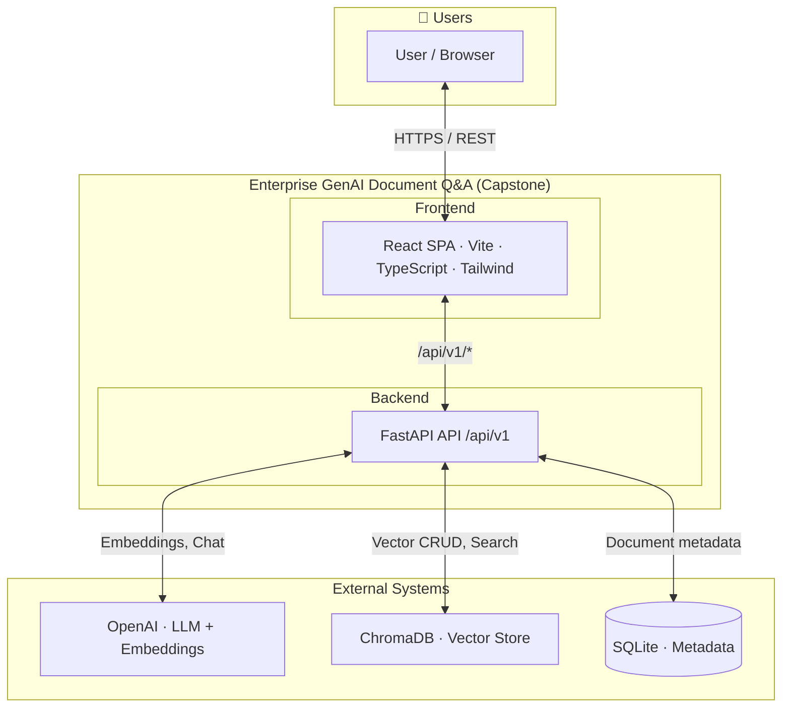

### RAG vs agent query (routing)

Questions go through the simple RAG pipeline or the full agent workflow (Planner → Retriever → Reasoner → Validator) based on the “Use agent workflow” toggle.

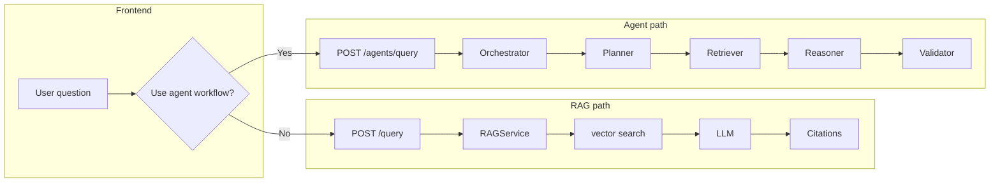

### Agent pipeline (Planner → Validator)

The agent workflow: plan → retrieve chunks → reason with LLM → validate citations and support status.

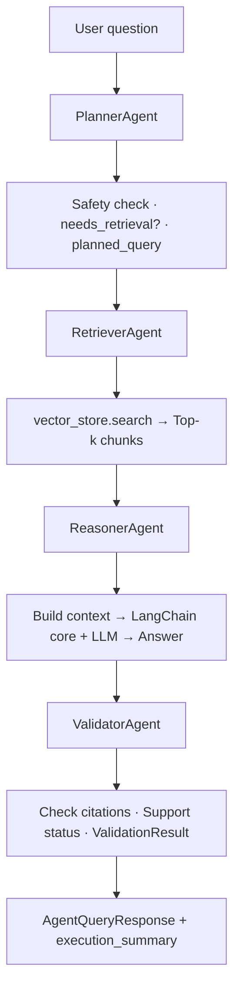

### LangChain agents and planning

The **agent path** uses a structured multi-agent pipeline built with **LangChain** patterns:

- **Agent structure** — Four agents run in sequence:
  1. **Planner** — Interprets the question, runs a safety check, and produces a **plan** (`needs_retrieval`, `planned_query`). Planning determines whether to run retrieval and what query to send to the vector store.
  2. **Retriever** — Runs vector search with the planned query and returns top-k chunks with scores.
  3. **Reasoner** — Uses **LangChain core** (`langchain_core.messages` + shared `BaseChatModel`) to build a system/user prompt and synthesize an answer from the retrieved context.
  4. **Validator** — Checks that the answer is grounded in the chunks and has citations; sets `support_status` and an execution summary.

- **Planning** — The `Plan` from the Planner includes `planned_query` (normalized question) and `needs_retrieval`. The orchestrator only calls Retriever and Reasoner when `needs_retrieval` is true; otherwise it returns early with a clear message. The frontend receives an **execution summary** (planned query, chunks retrieved, validation result) for transparency.

**More diagrams** (layered view, ingestion sequence, backend dependencies, data stores): **[docs/architecture/architecture-diagram.md](docs/architecture/architecture-diagram.md)**

---

## 📖 How to Use

This section is based on the **How to Use** guide for the Enterprise GenAI Document Q&A system. Upload the suggested document types and try the example questions below.

### Supported document types and example questions

#### 1. Enterprise AI Strategy Report (PDF / TXT)

- What are the strategic pillars of Orion’s AI strategy?
- How much investment is planned for AI initiatives?
- What outcomes are expected from the AI transformation?

#### 2. AI Governance Policy

- What are the principles of AI governance?
- What risk category would a customer-facing AI system fall under?
- What controls are required for high-risk AI systems?

#### 3. Cloud Infrastructure Cost Report

**Upload** your cost report (e.g. CSV), then ask:

- Which service has the highest cost?
- How much did AI training cost in March?
- What is the total cost across all months?

#### 4. Enterprise Customer Support Tickets

- Which issues remain unresolved?
- What is the average resolution time?
- Which category appears most frequently?

#### 5. Product Portfolio (Excel)

- Which industries use Fraud Detection AI?
- What is the revenue from Banking customers?
- Which product was launched most recently?

#### 6. System Architecture

- What components exist in the system architecture?
- What is the role of the feature store?
- What security controls are required?

---

### Example complex questions for RAG + agents

Use these to see the **agent workflow** combine multiple documents:

| # | Question | Documents the agent should combine |
|---|----------|-----------------------------------|
| **Q1** | How does Orion ensure responsible use of AI according to their strategy and governance documents? | Strategy report + Governance policy |
| **Q2** | Which AI product generates the highest revenue and which industry uses it? | Excel product sheet + Customer contracts |
| **Q3** | What is the most expensive cloud service and does it align with Orion's AI investment strategy? | `cloud_costs.csv` + Strategy report |
| **Q4** | Which unresolved support issues could impact AI products? | Support tickets + Product info |

Enable **“Use agent workflow”** on the Ask page so the Planner, Retriever, Reasoner, and Validator work together to answer these questions with citations and an execution summary.

---

## 📸 Screenshots and guide images

Images below are from the *How to use* guide (screenshots and step-by-step visuals).

<table>
<tr>
<td align="center">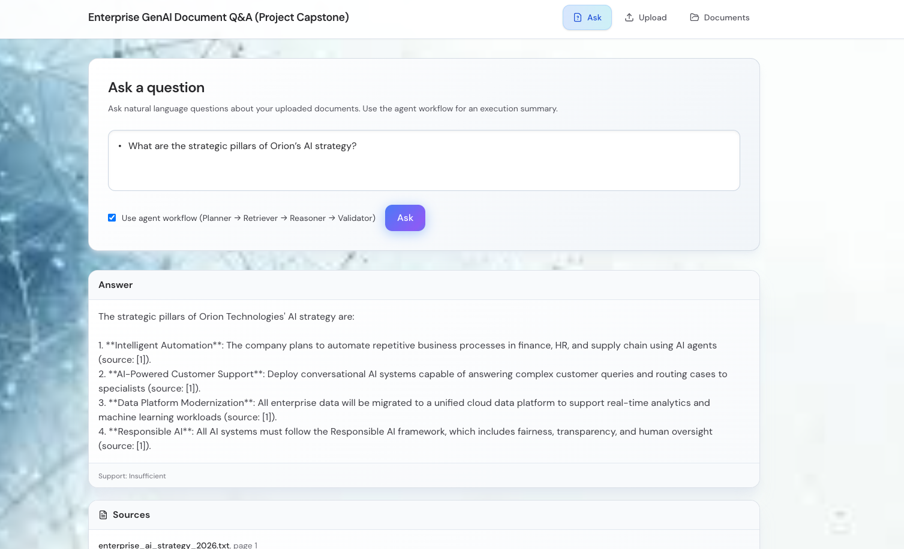</td>
<td align="center">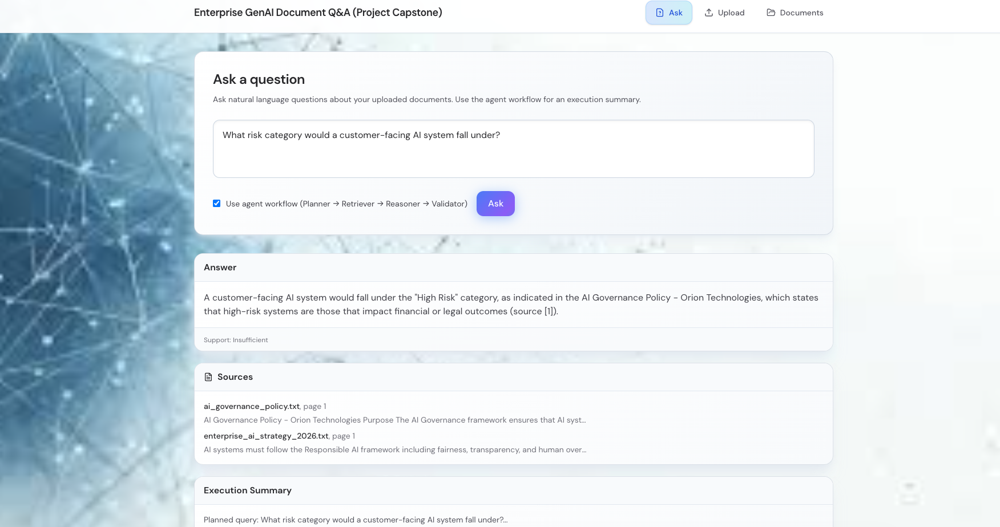</td>
<td align="center">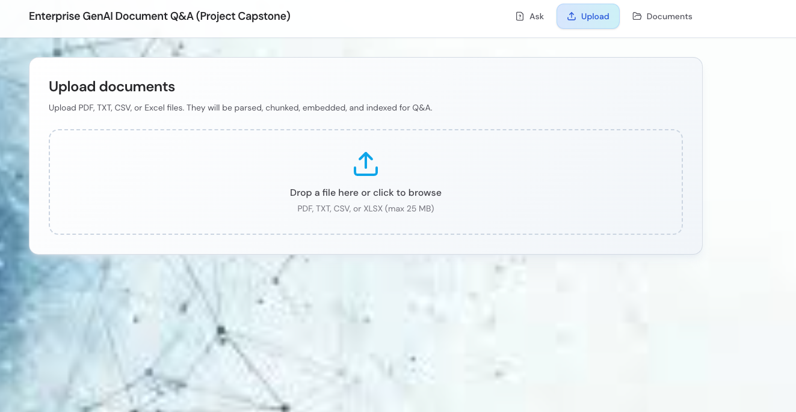</td>
</tr>
<tr>
<td align="center">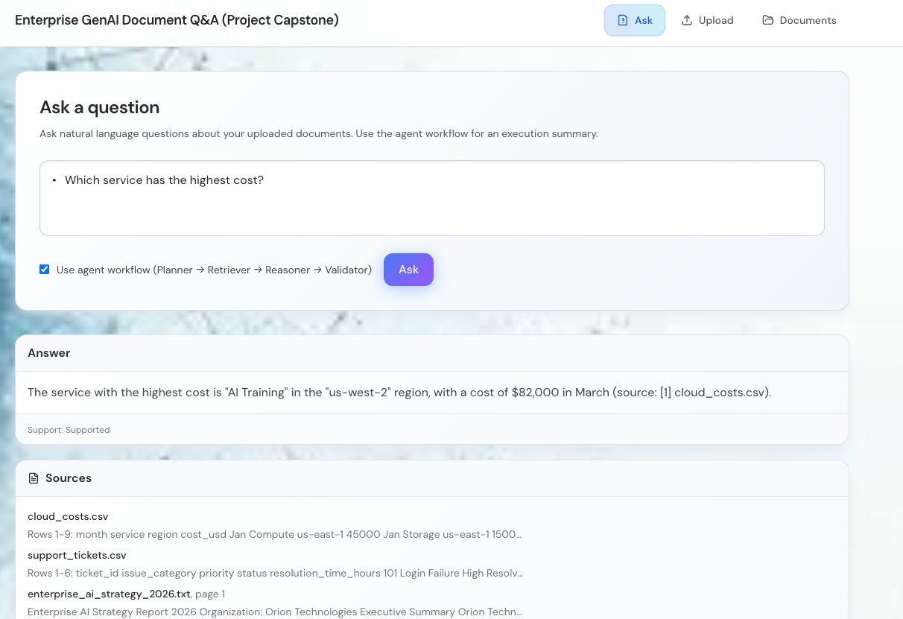</td>
<td align="center">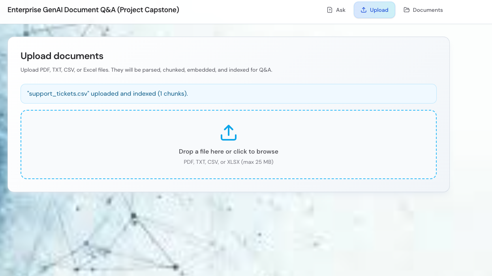</td>
<td align="center">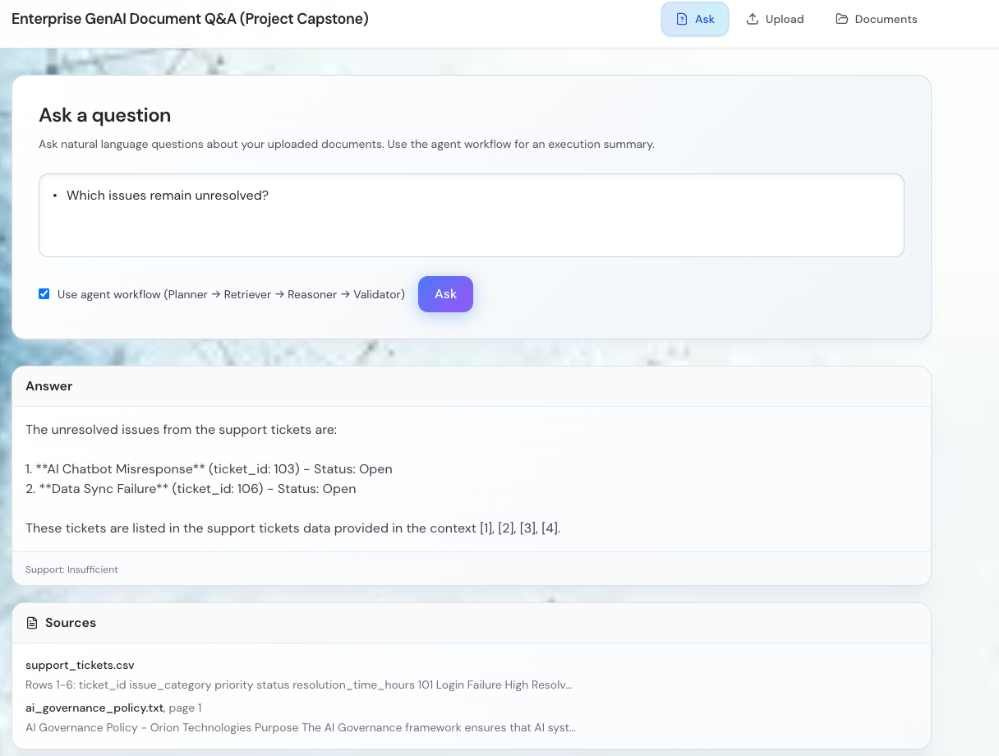</td>
</tr>
<tr>
<td align="center">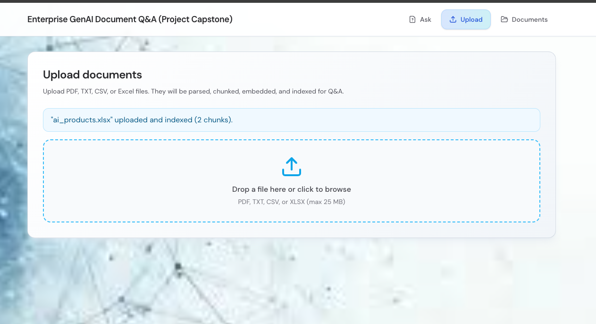</td>
<td align="center">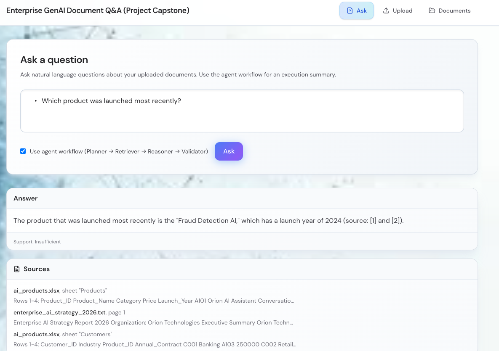</td>
<td></td>
</tr>
</table>

---

## 🏗️ Project structure

```
CapstoneProject/
├── backend/
│   ├── app/
│   │   ├── api/routes/       # health, documents, query
│   │   ├── core/             # config, logging
│   │   ├── db/               # SQLite metadata store
│   │   ├── models/           # DocumentChunk, ChunkMetadata
│   │   ├── rag/              # RAG pipeline
│   │   ├── agents/           # Planner, Retriever, Reasoner, Validator, Orchestrator
│   │   ├── schemas/          # Pydantic request/response
│   │   ├── services/         # parsing, chunking, embedding, vector_store, ingestion
│   │   ├── utils/            # security, file validation
│   │   └── main.py
│   ├── tests/
│   ├── requirements.txt
│   └── Dockerfile
├── frontend/
│   ├── src/
│   │   ├── components/       # Layout, UploadZone, AnswerPanel
│   │   ├── pages/            # UploadPage, DocumentsPage, AskPage
│   │   ├── lib/api.ts
│   │   └── types/
│   ├── package.json
│   ├── vite.config.ts
│   └── tailwind.config.js
├── docs/
│   ├── architecture/        # Complex architecture diagrams (Mermaid)
│   │   └── architecture-diagram.md
│   ├── readme-images/       # Screenshots from How to Use guide
│   ├── architecture.md
│   ├── api.md
│   └── deployment.md
├── sample_data/
├── docker-compose.yml
└── README.md
```

---

## ⚙️ Backend overview

- **Config**: `app/core/config.py` — env-based settings (paths, limits, LLM/embedding keys).
- **Parsing**: PDF (pdfplumber), TXT, CSV (pandas), Excel (openpyxl) with page/sheet/row metadata.
- **Chunking**: Recursive split with configurable size/overlap.
- **Embeddings**: OpenAI embeddings or local sentence-transformers.
- **Vector store**: ChromaDB with persistent storage.
- **RAG**: Retrieve top-k → sanitize context → LLM → citations.
- **Agents**: Planner → Retriever → Reasoner → Validator; Orchestrator returns execution summary.
- **API**: `POST /documents/upload`, `GET /documents`, `POST /query`, `POST /agents/query`, `GET /health` under `/api/v1`.

---

## 🖥️ Frontend overview

- **Stack**: React 18, TypeScript, Vite, Tailwind (DM Sans, JetBrains Mono).
- **Pages**: **Upload** (drag-and-drop), **Documents** (list + status), **Ask** (question + RAG vs agent toggle).
- **Answer panel**: Answer text, sources/citations, execution summary (for agent), retrieved chunks accordion.

---

## 🚀 Quick start

### Prerequisites

- Python 3.9+
- Node 18+
- (Optional) Docker

### 1. Backend

```bash
cd backend
python -m venv .venv
source .venv/bin/activate   # Windows: .venv\Scripts\activate
pip install -r requirements.txt
cp ../.env.example .env    # Replace OPENAI_API_KEY=xxx with your key to enable LLM
mkdir -p data/uploads data/chroma
uvicorn app.main:app --reload --host 0.0.0.0 --port 8000
```

- API: http://localhost:8000  
- Swagger: http://localhost:8000/docs  

### 2. Frontend

```bash
cd frontend
npm install
npm run dev
```

- App: http://localhost:3000 (proxies `/api` to backend)

### 3. Use the app

1. **Upload**: Go to **Upload**, drop a PDF/TXT/CSV/XLSX file (see `sample_data/` for examples).
2. **Ask**: Go to **Ask**, type a question, optionally enable **“Use agent workflow”**, and click **Ask**.
3. **Documents**: View the list of uploaded files and their status.

---

## 🔐 Environment variables

| Variable | Description | Default |
|----------|-------------|---------|
| `OPENAI_API_KEY` | OpenAI (or compatible) API key | — |
| `OPENAI_API_BASE` | Custom API base URL | — |
| `LLM_MODEL` | Chat model name | `gpt-4o-mini` |
| `EMBEDDING_MODEL` | Embedding model | `text-embedding-3-small` |
| `USE_LOCAL_EMBEDDINGS` | Use sentence-transformers instead of API | `false` |
| `UPLOAD_DIR` | Directory for uploads | `data/uploads` |
| `CHROMA_PERSIST_DIR` | ChromaDB persistence path | `data/chroma` |
| `MAX_FILE_SIZE_MB` | Max upload size (MB) | `25` |
| `CHUNK_SIZE` / `CHUNK_OVERLAP` | Chunking parameters | `1000` / `200` |
| `TOP_K_RETRIEVE` | Number of chunks to retrieve | `5` |

See [.env.example](.env.example) for the full list.

---

## 🐳 Docker

```bash
cp .env.example .env
docker compose up --build
```

- Backend: http://localhost:8000  
- Frontend: http://localhost:3000  
- Data: `rag_data` volume

---

## 📡 API overview

| Method | Endpoint | Description |
|--------|----------|-------------|
| GET | `/api/v1/health` | Health check |
| POST | `/api/v1/documents/upload` | Upload document (multipart) |
| GET | `/api/v1/documents` | List documents |
| GET | `/api/v1/documents/{id}` | Document metadata |
| POST | `/api/v1/query` | RAG query |
| POST | `/api/v1/agents/query` | Agent workflow query |

Details and examples: [docs/api.md](docs/api.md).

---

## 🧪 Tests

```bash
cd backend
pip install -r requirements.txt
pytest -v
```

---

## 📚 Documentation

- [Architecture](docs/architecture.md) — Components, flows, and narrative  
- [Architecture diagrams](docs/architecture/architecture-diagram.md) — **Complex Mermaid diagrams** (system context, layers, ingestion, RAG vs agent, data stores)  
- [API](docs/api.md) — Endpoints and request/response examples  
- [Deployment](docs/deployment.md) — Local and Docker deployment  

---

## ⚠️ Limitations

- No authentication; single-user assumption  
- ChromaDB only (other vector backends via abstraction)  
- No streaming responses; no conversation history  
- Document deletion / re-indexing not implemented in UI  

---

## 🔮 Future improvements

- Auth stub, document delete and re-index  
- Hybrid retrieval (keyword + semantic), re-ranking  
- Feedback (thumbs up/down), streaming, admin logs  
- Deploy to Render / Railway / Vercel / AWS  

---

## License

MIT (or your choice).
