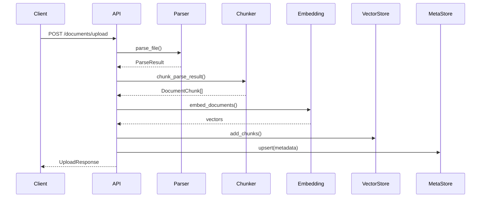
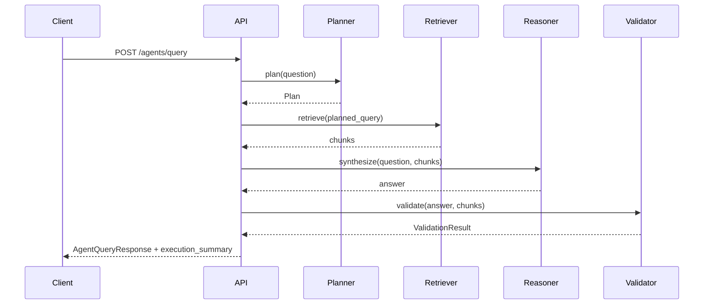

# Architecture

## Overview

The **Enterprise GenAI Document Q&A** system is a full-stack application that ingests enterprise documents, indexes them in a vector store, and answers natural language questions using RAG (Retrieval-Augmented Generation) and an agent-based workflow.

## Complex Architecture Diagrams

**Full diagrams** (system context, layered components, ingestion flow, RAG vs agent, agent pipeline, backend dependencies, data stores) are in:

- **[docs/architecture/architecture-diagram.md](architecture/architecture-diagram.md)** — Mermaid diagrams that render in GitHub and most Markdown viewers.

Below is a quick ASCII overview; for the complete picture use the link above.

## System Components

```
┌─────────────────────────────────────────────────────────────────────────────┐
│                              Frontend (React + Vite)                         │
│  Upload │ Documents List │ Ask (RAG / Agent query) │ Citations │ Summary     │
└─────────────────────────────────────────────────────────────────────────────┘
                                      │
                                      │ REST /api/v1
                                      ▼
┌─────────────────────────────────────────────────────────────────────────────┐
│                              Backend (FastAPI)                               │
│  ┌─────────────┐  ┌─────────────┐  ┌─────────────┐  ┌─────────────────────┐│
│  │ Upload API  │  │ Documents   │  │ Query API   │  │ Agents Query API     ││
│  │ POST /upload│  │ GET /docs   │  │ POST /query │  │ POST /agents/query   ││
│  └──────┬──────┘  └──────┬──────┘  └──────┬──────┘  └──────────┬────────────┘│
│         │                │                │                     │             │
│         ▼                ▼                ▼                     ▼             │
│  ┌──────────────────────────────────────────────────────────────────────────┐│
│  │ Ingestion Service │ RAG Service          │ Agent Orchestrator             ││
│  │ Parsing → Chunk   │ Retrieve → Prompt →  │ Planner → Retriever →          ││
│  │ → Embed → Index   │ LLM → Citations     │ Reasoner → Validator           ││
│  └────────┬──────────┴──────────┬──────────┴────────────────┬───────────────┘│
│           │                     │                            │                │
└───────────┼─────────────────────┼────────────────────────────┼────────────────┘
            │                     │                            │
            ▼                     ▼                            ▼
┌───────────────────┐  ┌─────────────────┐  ┌───────────────────────────────┐
│ File storage      │  │ Vector store     │  │ Metadata store                 │
│ (uploads dir)     │  │ (ChromaDB)       │  │ (SQLite)                       │
└───────────────────┘  └─────────────────┘  └───────────────────────────────┘
```

## Request Flows

### Document Ingestion

1. User uploads a file via `POST /api/v1/documents/upload`.
2. Backend validates type (PDF, TXT, CSV, XLSX) and size.
3. File is stored temporarily; **ParsingService** extracts text (and pages/sheets).
4. **ChunkingService** splits text into overlapping chunks with metadata.
5. **EmbeddingService** (OpenAI or local sentence-transformers) produces vectors.
6. **VectorStoreService** (ChromaDB) stores embeddings and metadata.
7. **MetadataStore** (SQLite) records document ID, status, chunk count.



### RAG Query

1. User sends `POST /api/v1/query` with `{ "question": "..." }`.
2. **RAGService** embeds the question and runs vector similarity search.
3. Top-k chunks are retrieved; content is sanitized (prompt-injection mitigation).
4. A prompt is built with context + question; LLM generates an answer.
5. Citations are built from chunk metadata; response returned.

### Agent Query

1. User sends `POST /api/v1/agents/query` with `{ "question": "..." }`.
2. **PlannerAgent**: validates query, decides retrieval is needed, normalizes question.
3. **RetrieverAgent**: same vector search as RAG.
4. **ReasonerAgent**: synthesizes answer from chunks via LLM.
5. **ValidatorAgent**: checks citations and grounding; sets support status.
6. Response includes `execution_summary` (planned query, chunks retrieved, validation summary) — no raw chain-of-thought.



## Storage Layers

| Layer        | Technology | Purpose                                      |
|--------------|------------|----------------------------------------------|
| Uploaded files | Local dir | Temporary store before parsing; can be deleted after ingest |
| Vector index | ChromaDB   | Embeddings + metadata; top-k similarity search |
| Metadata     | SQLite     | Document list, status, chunk count, errors   |

## Safety and Guardrails

- **File validation**: type and size limits.
- **Prompt injection**: sanitization of retrieved text before inclusion in prompts.
- **Safe query check**: reject empty or suspicious user queries.
- **Grounded answers**: instructions to answer only from context; “I could not find enough evidence” when insufficient.
- **Validator agent**: checks that the answer references sources.

## Limitations and Future Enhancements

- **Limitations**: Single-user; no auth; ChromaDB only (no Pinecone/Weaviate yet); no streaming; no conversation history.
- **Future**: Auth stub, document deletion/re-index, hybrid retrieval, re-ranking, feedback, streaming, cloud deployment.
