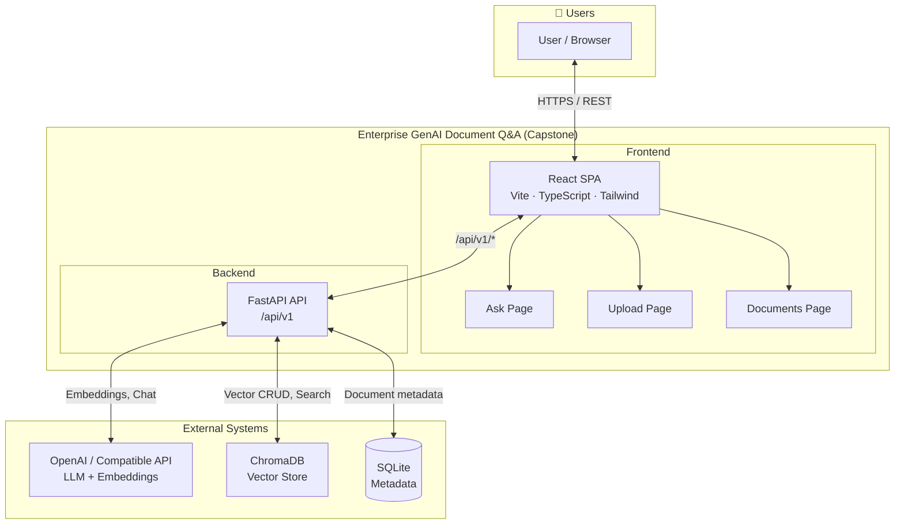
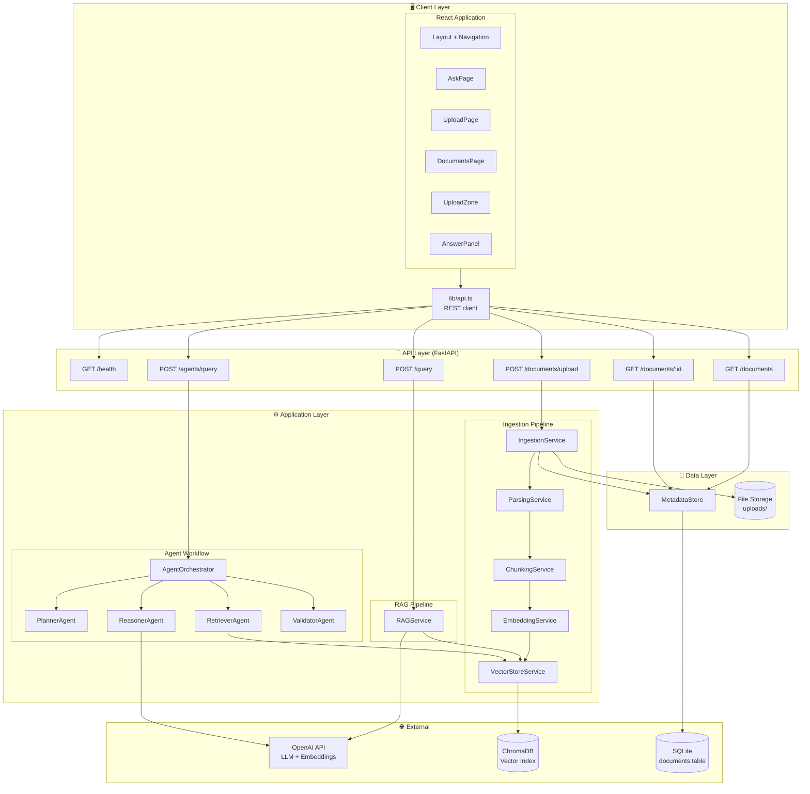
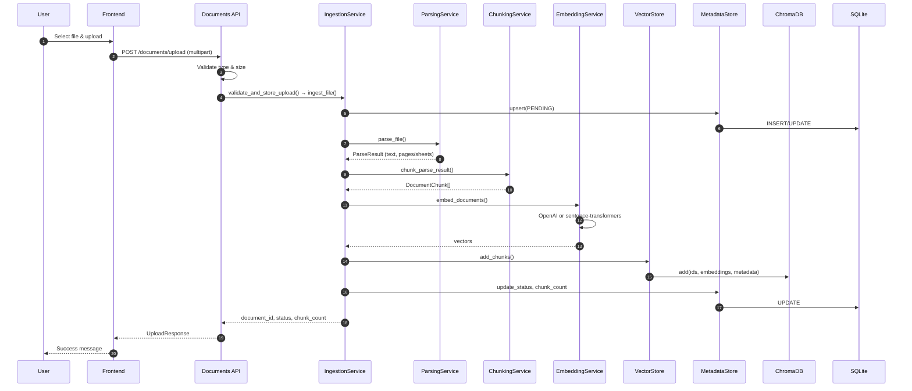
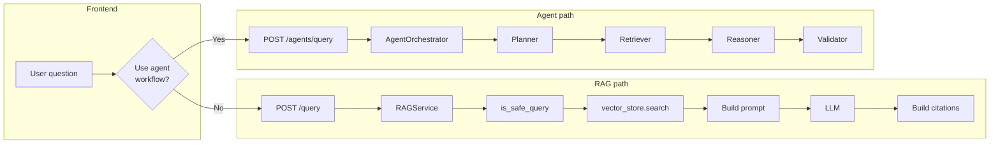
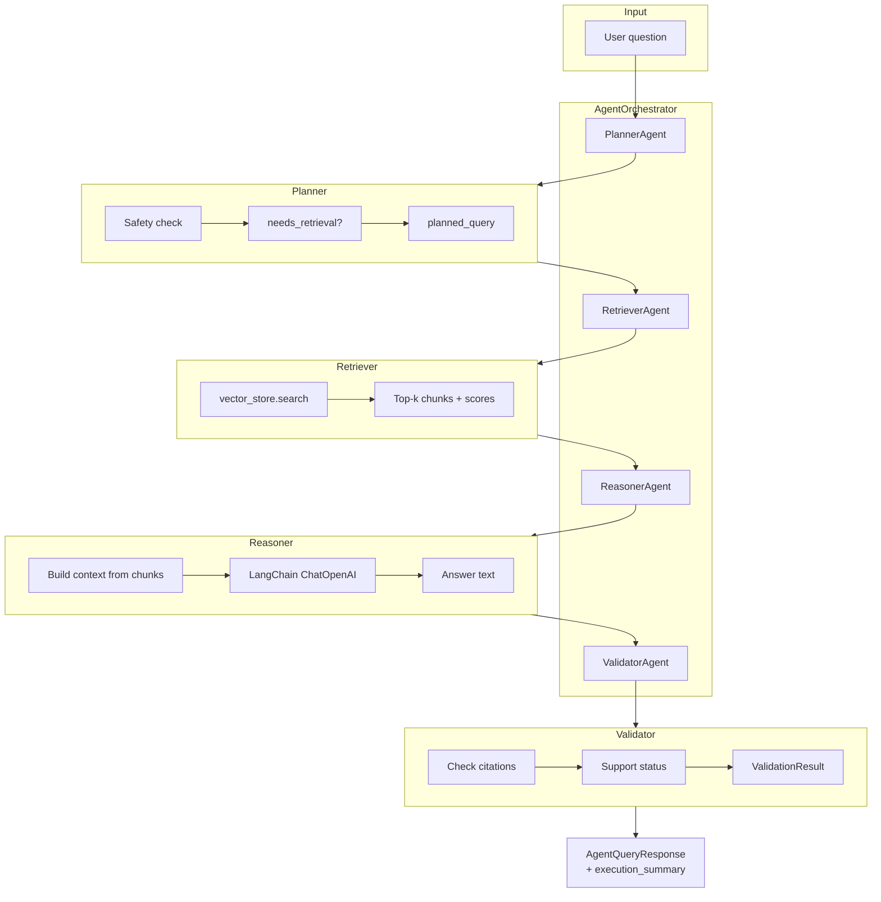
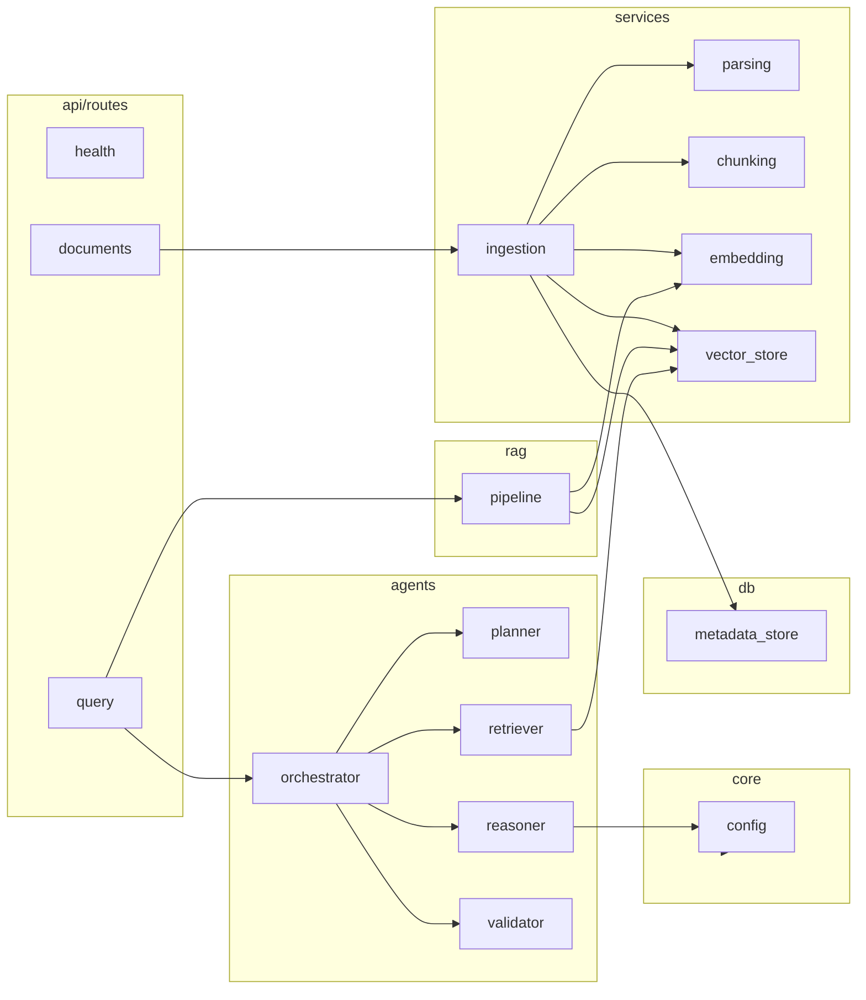
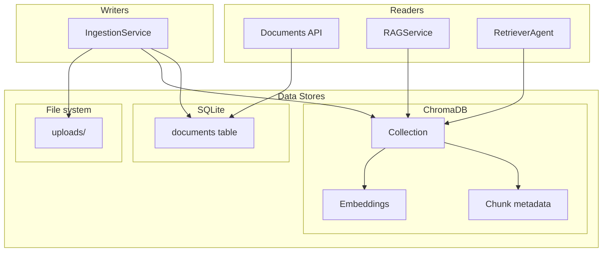

# Capstone Project — Architecture Diagrams

This folder contains the **complex architecture diagrams** for the Enterprise GenAI Document Q&A system (Capstone). The diagrams are written in [Mermaid](https://mermaid.js.org/) and render in GitHub, GitLab, and most Markdown viewers.

The **agent path** is implemented as a **LangChain-style multi-agent pipeline**: **Planner** (planning and safety) → **Retriever** → **Reasoner** (LangChain core messages + shared BaseChatModel) → **Validator**. **Planning** produces a `Plan` (`needs_retrieval`, `planned_query`) that drives whether retrieval runs and what query is sent to the vector store; the orchestrator returns an execution summary (planned query, chunks retrieved, validation result). See [Architecture](../architecture.md) for the full narrative on LangChain agents and planning.

---

## 1. System Context (High-Level)

Shows the system boundary and external actors/integrations.

---

## 2. Layered Architecture (All Components)

Full stack from client down to data and external services.

---

## 3. Document Ingestion Flow (Sequence)

End-to-end flow from upload to indexed document.

---

## 4. RAG vs Agent Query (Decision Flow)

How a question is routed and processed.

---

## 5. Agent Pipeline Detail (Planner → Validator)

Internal steps of the agent workflow.

---

## 6. Backend Module Dependency Graph

How backend packages depend on each other (simplified).

---

## 7. Data Stores and Their Use

Where data lives and who reads/writes it.

---

## LangChain agents and planning (reference)

| Agent | Role | Planning / outputs |
|-------|------|--------------------|
| **PlannerAgent** | Safety check; decide if retrieval needed; normalize question | **Plan**: `needs_retrieval`, `planned_query`, `reasoning_summary`, `error` |
| **RetrieverAgent** | Vector search with `planned_query` | Top-k `(DocumentChunk, score)` |
| **ReasonerAgent** | Build context; LangChain core (SystemMessage, HumanMessage) + BaseChatModel; synthesize answer | Answer text |
| **ValidatorAgent** | Check grounding and citations | **ValidationResult**: `passed`, `support_status`, `summary`, `issues` |

The **orchestrator** runs these in sequence and returns **AgentQueryResponse** with **execution_summary** (planned query, retrieval performed, chunks count, validation passed, step summaries).

---

## Summary

| Diagram | Purpose |
|--------|---------|
| **1. System Context** | High-level boundary and external integrations |
| **2. Layered Architecture** | All components across client, API, application, data, external |
| **3. Document Ingestion** | Sequence of steps from upload to indexed document |
| **4. RAG vs Agent** | Routing and flow for simple RAG vs agent workflow |
| **5. Agent Pipeline** | Planner → Retriever → Reasoner → Validator detail |
| **6. Backend Module Dependency** | Internal package dependencies |
| **7. Data Stores** | Which services use which stores |

For narrative and flows, see the main [Architecture](architecture.md) doc (parent `docs/` folder).
